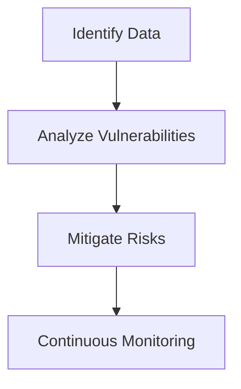
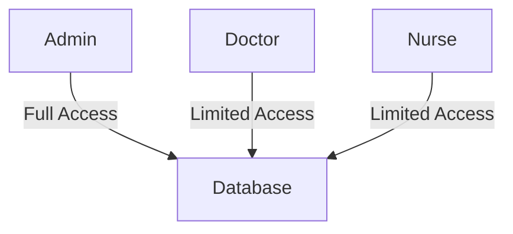
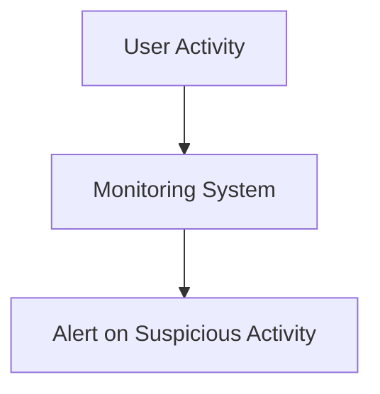

# How to Build a HIPAA-Compliant App as a Developer

Building a HIPAA-compliant app involves careful planning to protect the privacy and security of health information. Below is a comprehensive guide and checklist to ensure compliance.

## 

### **1. Understand HIPAA Requirements**
To comply, developers must be familiar with the following:
- **Privacy Rule**: Controls the use and disclosure of Protected Health Information (PHI).
- **Security Rule**: Specifies safeguards for electronic PHI (ePHI).
- **Breach Notification Rule**: Requires notifications if PHI is compromised.

### **Example:**
For a telehealth app, ensure video calls are encrypted, and only authorized healthcare providers can access patient data.

---

## 

### **2. Conduct a Risk Assessment**
Identify where PHI is stored, how it’s accessed, and any vulnerabilities that could lead to unauthorized exposure.

- [ ] Conduct a thorough risk analysis.
- [ ] Identify and mitigate vulnerabilities.

### **Diagram: Security Audit Workflow**

---

## 

### **3. Implement Security Safeguards**
#### Administrative Safeguards:
- [ ] Develop policies for data protection.
#### Physical Safeguards:
- [ ] Restrict access to physical devices storing ePHI.
#### Technical Safeguards:
- [ ] Encrypt data (both in transit and at rest).
- [ ] Use multi-factor authentication (MFA).

---

## 

### **4. Data Encryption**
- **Encryption in Transit**: Use SSL/TLS for secure data transmission.
- **Encryption at Rest**: Use AES encryption standards to protect stored data.

### **Example:**
For a patient portal, ensure that every data exchange, including login, is encrypted with SSL/TLS to prevent man-in-the-middle attacks.

---

## 

### **5. Access Control**
- [ ] Implement role-based access.
- [ ] Enable strong password policies and MFA.

### **Diagram: Role-Based Access**

---

## 

### **6. Data Backup & Recovery**
- [ ] Regularly back up encrypted data.
- [ ] Ensure robust recovery protocols are in place.

### **Example:**
An EHR system should have automated daily backups with encrypted off-site storage to prevent data loss during emergencies.

---

## 

### **7. Secure Data Transmission**
- [ ] Use secure protocols (e.g., HTTPS) for all communication.
- [ ] Regularly test for vulnerabilities.

### **Checklist**
- [ ] Encrypt ePHI data with SSL/TLS.
- [ ] Regularly update encryption keys.

---

## 

### **8. Business Associate Agreements (BAAs)**
If a third-party service handles ePHI (e.g., cloud storage, analytics):
- [ ] Ensure they sign a Business Associate Agreement (BAA) committing to HIPAA compliance.

### **Example:**
Before integrating a cloud storage provider, have them sign a BAA to ensure they are accountable for protecting ePHI.

---

## 

### **9. Audit & Monitoring**
- [ ] Continuously monitor app activities for unauthorized access.
- [ ] Perform regular audits to maintain compliance.

### **Diagram: Continuous Monitoring**

---

## 

### **10. Training & Awareness**
- [ ] Educate the development team on HIPAA rules.
- [ ] Regularly update knowledge on regulatory changes.

### **Checklist**
- [ ] Conduct regular training sessions.
- [ ] Implement a system for reporting security incidents.

---

## **Conclusion**
Creating a HIPAA-compliant app is not just about checking boxes; it’s about embedding security and privacy at every stage of development. By following this comprehensive guide and checklist, developers can ensure their apps are safe, secure, and trustworthy.
